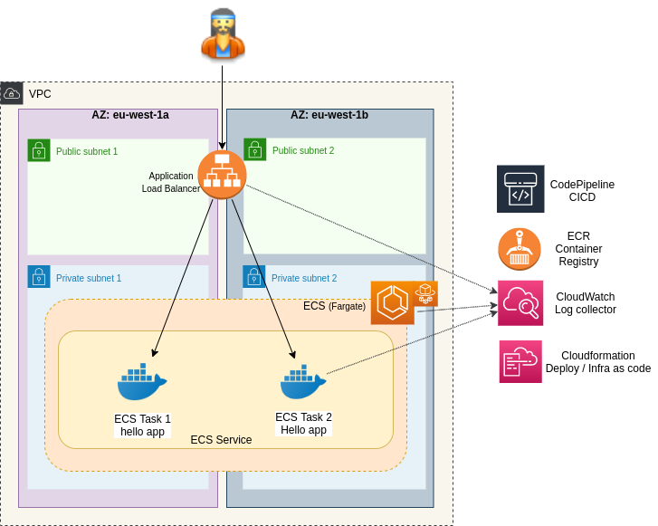
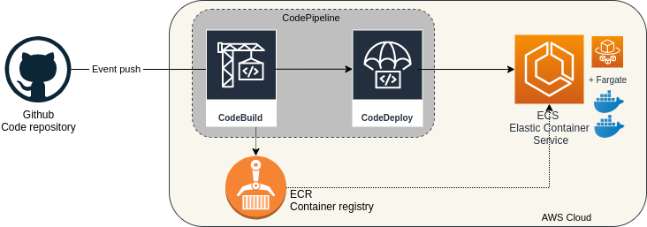

# MyApp: HA container in ECS

## Overview
This setup will deploy a redundant helloworld container on ECS fargate, with automatic CI/CD from AWS.

More info: you can find an overview of that setup on my [blog](https://greg.satoshi.tech/ecs)

### Infra


- Cloud: AWS
- [ECS](https://aws.amazon.com/ecs): container orchestrator (on 2 availability zones for redundancy)
- [ECR](https://aws.amazon.com/ecr): container registry to store hello image
- App: a simple hello world in Nodejs (folder `hello`)
- Code source: Github
- Deployment: [CloudFormation](https://aws.amazon.com/cloudformation) describe all component to be deployed. One command line will setup 
- CI/CD: [CodePipeline](https://aws.amazon.com/codepipeline) to build and deploy the container in ECS
the infra and return an url to access the application.


### CI/CD flow diagram



A simple `git push` from a developer in Github will launch the whole CI/CD process. Docker image will build and ECS will update to run that new image without any downtime.

## Deploy

### Prerequisites
Please setup on your laptop:
- AWS cli and AWS account to deploy in `eu-west-1`
- Docker and Compose
- Github personal token with `admin:repo_hook, repo` rights from [here](https://github.com/settings/tokens)

### Test app on your laptop
Check the app locally:
```
cd hello
docker-compose up -d
curl localhost 8080
```

### Deploy to AWS
- Set a unique project prefix and your github token:
```
cd cloudformation
export CF_DEMO_ENVIRONMENT=myapp-demo-ecs   <-- please change to your prefix!
export GITHUB_TOKEN=xxxx                    <-- You token here
```

- Because CodePipeline needs to know the ECS ARN, and ECS needs CodePipeline to build the image to run an ECS task, we are deploying the infra in 2 steps

#### Step 1
 - Deploy infra with a dummy `ECS Service Arn`=REPLACE_AFTER_ECS_DEPLOYED
```
./deploy.sh ${CF_DEMO_ENVIRONMENT} [GH username] [GH repo] [GH branch] [GH token] [ECS Service Arn]

Ex:
./deploy.sh ${CF_DEMO_ENVIRONMENT} gregbkr myapp-ecs master ${GITHUB_TOKEN} REPLACE_AFTER_ECS_DEPLOYED
```
- Wait for the script to complete. Check that image has been build in ERC, and that ECS service is running.
- If it takes more than 20 minutes, check cloudformation waiting components in event. ECS may waiting for the container to be up. Please check that the build was successful and the image present in ECR.

- Find the ServiceArn of the ECS:
```
export ECS_SERVICE_ARN=$(aws cloudformation \
   describe-stacks \
   --query 'Stacks[0].Outputs[?OutputKey==`EcsServiceArn`].OutputValue' \
   --stack-name ${CF_DEMO_ENVIRONMENT})
```

#### Step 2
- Then update the stack, it will link CodeDeploy to the Ecs Service Arn
```
./deploy.sh ${CF_DEMO_ENVIRONMENT} gregbkr myapp-ecs master ${GITHUB_TOKEN} ${ECS_SERVICE_ARN}
```

### Check
- Wait for ECS to update the tasks, and check the app:
```
aws cloudformation \
   describe-stacks \
   --query 'Stacks[0].Outputs[?OutputKey==`WebServiceUrl`].OutputValue' \
   --stack-name ${CF_DEMO_ENVIRONMENT}
```
- See the pipeline
```
aws cloudformation \
   describe-stacks \
   --query 'Stacks[0].Outputs[?OutputKey==`PipelineUrl`].OutputValue' \
   --stack-name ${CF_DEMO_ENVIRONMENT}
```

### CI/CD
- Change the output of the hello world here: `nano hello/server.js` 
- Push code in github
- Check the status of CI/CD in your browser
- Then check again your app

### Destroy all
- Destroy all stack: `./delete-stacks.sh ${CF_DEMO_ENVIRONMENT}`
